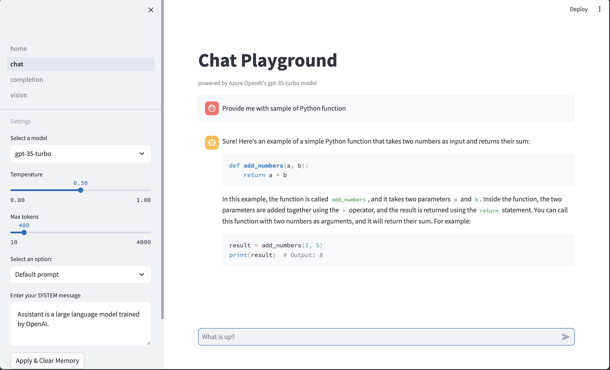
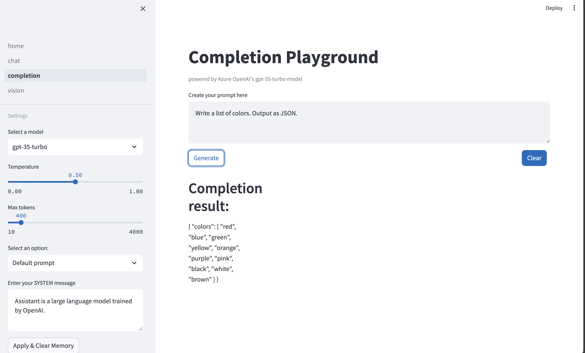

# aoai-simple-playground


## Deployment
1. create Web App in Azure with link to this repo to activate GHA deployment
2. configure app startup command: `python -m streamlit run home.py --server.port 8000 --server.address 0.0.0.0`
3. confuigure app env variables:
```shell
AZURE_OPENAI_ENDPOINT=
AZURE_OPENAI_API_KEY=
AZURE_OPENAI_API_VERSION=2024-04-01-preview
AZURE_OPENAI_MODELS_DEPLOYEMNTS=deployment1,deployment2
AZURE_OPENAI_VISION_MODEL_DEPLOYEMNTS=gpt-4-turbo
SCM_DO_BUILD_DURING_DEPLOYMENT=true
```

4. deploy the app

```shell
az webapp deploy --resource-group YOUR_RG --name YOUR_APP  --src-path playground.zip
```


## Example of playgrounds
### Example of Chat playground



### Example of Completion playground
